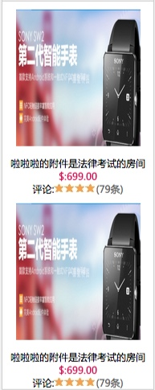

# 商品详情选择页
商品详情页的设计与开发过程详细介绍,下图是一个商品详情页的PSD切片


## 设计模块
这个网页的整体设计布局来说,可以分成三块:

* Head模块:这个部分对于网站是可以共用的
* Middle模块:这个部分是需要单独处理的用于展示商品详情
* Down模块:这个部分也是单独需要设计作为商品列表展示


## 布局

###Middle模块:

```
div name = description_info
	div name = leftArea   ##左边框
		
	div name = rightArea  ##右边框
div
```


## 组件

###导航条


####HTML
```
    <div class="user_position comWidth">
        首页
        <span>&nbsp;</span>
        <a href="#">平板电脑</a><span>&nbsp;&gt;</span>
        <a href="#">苹果电脑</a><span>&nbsp;&gt;</span>
        <a href="#">Apple</a><span>&nbsp;&gt;</span>
        <a href="#">Mac</a><span>&nbsp;&gt;</span>
        <em>平板电脑</em>
    </div>
```
####CSS
```
.user_position{height:42px;line-height: 42px;font-family: "Microsoft YaHei", "微软雅黑";font-size: 12px;}
.user_position em{font-style: normal;}
.user_position a:hover{text-decoration: underline}
```
####设计要点
* 通过设计行高来使导航的位置上下都有间隔
* 通过a,span标签来区分导航内容和导航间的特殊字符

###轮播图片

####HTML

```
	<div class="img_show">
	    <div class="big_img">
	        <a href="#"></a>
	    </div>
	    <ul class="sm_img clearfix">
	        <li><a href="#"></a></li>
	        <li><a href="#"></a></li>
	        <li><a href="#"></a></li>
	        <li><a href="#"></a></li>
	        <li><a href="#"></a></li>
	    </ul>
	</div>
```
####CSS

```
.img_show{width: 309px;}
.img_show .big_img{width:100%;height: 341px; text-align: center}
.img_show .sm_img{width:265px;margin:0 auto;}
.img_show .sm_img li{float: left;margin-left: -1px;}
.img_show .sm_img img{width:52px;height: 52px;border: 1px solid #CCC}
.img_show .sm_img .active{border: 1px solid #317EE7;position:relative;}
```

####设计要点
* 这个设计是外面一个大的div,里面包含两个小的div,分别用来包含上面的大图和下面的小图列表
* 上面大图的居中是通过外面包的div设置text-align:center来将里面的图片居中
* 下面的排列小图居中,因为里面的图片元素有五个,所以只能通过设置外面的ul设置它的宽度和最外层的父级div的margin:0px auto来设置居中
* 对于小图片的active的边框设计有两个技巧,一个是设置border:1px,同时margin-left:-px,来避免border的重叠出现由1px变成2px,还有就是最外层的div需要设置padding:1px来往右拉
* 设置active的时候有一个小技巧就是通过设置relative来使得新加的样式处于上层

###带图标

####HTML
```
<span class="hg">
	<i class="hg_icon">字体</i>购ipad加价优惠够配件或USB充电插座
</span>
```
####CSS
```
.hg{padding-top: 5px;display: inline-block;line-height: 16px;text-indent: 0px;}
.hg_icon{background: url("../image/huangou.jpg") left top no-repeat;width:52px;height: 18px;margin-right: 10px;
    display: inline-block;font-size: 12px;font-family: "Microsoft YaHei", "微软雅黑";font-style: normal;color: white;text-indent: 10px;
}
```
####设计要点
* 通过I图标设置背景图片,同时里面包含字体,这样一个带文本的图标就做出来
* 其中图标的大小和图片一致,同时字体的排列可以通过设置font的样式可以设置,同时设置indent可以调整字体的排列
* 确保i里面的有内容，才能保证两边的内容是一致对齐,同时span进行包裹

###组合标题

####HTML
```
	<div class="desc_content">
	    <h3 class="productdetail_title">全网底价 Apple 苹果 iPad mini 16G </h3>
	    <div class="dl clearfix">
	        <div class="dt">慕课网</div>
	        <div class="dd"><span class="desc_money"><em>￥</em>1999.00</span></div>
	    </div>
	    <div class="dl clearfix">
	        <div class="dt">优惠</div>
	        <div class="dd">
	            <span class="hg"><i class="hg_icon">字体</i>购ipad加价优惠够配</span>
	        </div>
	    </div>
	</div>
```
#### CSS
```
.desc_content{font-family: "Microsoft YaHei", "微软雅黑";  padding:10px;}
.desc_content h3 {line-height: 22px; font-size: 16px;font-weight: bold;padding:13px 25px;}
.desc_content .dl{text-indent:17px;margin: 10px;}
.desc_content .dt{float:left;width:75px;line-height: 25px;}
.desc_content .dd{float:left;line-height: 25px;}
.desc_content .desc_money{color: red; font-size: 18px;}
.desc_content em{font-size:12px;list-style: none}
.desc_content .hg{padding-top: 5px;display: inline-block;line-height: 16px;text-indent: 0px;}
.desc_content .hg_icon{background: url("../image/huangou.jpg") left top no-repeat;width:52px;height: 18px;margin-right: 10px;display: inline-block;font-size: 12px;font-family: "Microsoft YaHei", "微软雅黑";font-style: normal;color: white;text-indent: 10px;
}
```
####设计要点
* 总体布局是外面有一个大div进行嵌套
* 其中包含了一个h3是负责主标题
* 还有就是dl dt dd的内容用户负责下面两个不同的列


###带下拉内容的下拉框


####HTML
```
	<div class="select">
	    <span>海淀区五环内</span>
	    <span class="downloadcart"></span>
	    <ul class="show_select">
	        <li>啦啦啦</li>
	        <li>啦啦啦</li>
	        <li>啦啦啦</li>
	    </ul>
	</div>
```

####CSS
```
.select{
    float: left;
    border: 1px solid #999;
    height: 22px;
    line-height: 22px;
    background: #FFFFFF;
    padding-left:10px;
    padding-right:20px;
    position:relative;
}

.select .downloadcart{
    background: url('../image/cartdown.jpg') center center no-repeat;
    height:100%;
    width:20px;
    position:absolute; top:0;right:0;
}
.select .show_select{
    position:absolute; left:-1px; top:23px;
    width:100px;
    border: 1px solid #999;
    line-height: 22px;
    background: #FFFFFF;
    font-family: "Microsoft YaHei", "微软雅黑";
    display: none;
}
```

####设计要点
* 通过一个select来设定背景边框
* 里面包含两个span,其中一个span是存储文字,另外一个span是用来防止下拉箭头
* 垂直排列的就是下拉框的内容通过ul li来承载,这里使用display:none来隐藏了

###不带下拉内容的下拉框

####HTML
```
<dd class="screening_more">
        <ul>
            <li><a href="#">Samsung/三星</a></li>
        </ul>
</dd>
```
####CSS
```
.screening_more{
    border:#CCC solid 1px;height:23px;line-height: 23px;
    margin-top:4px;padding-right: 11px;padding-left: 11px;margin-right:10px;
    text-align: left;
    float:left;

}
.screening_more a{
    background: url('../image/cartdown.jpg') right center no-repeat;
    padding-right: 14px;
}
```
####设计要点
* 外面通过dd或者div绘制边框
* 里面则通过a标签放置图片和文字

###水平选择方块列表

####HTML
```
   <div class="desc_item desc_item_active">WIFI 16G PC</div>
   <div class="desc_item">WIFI 16G PC</div>
   <div class="desc_item">WIFI 16G PC</div>
```
####CSS
```
.desc_item{color:#666;padding:9px 10px;border:#CCC solid 1px;float: left;background-color: #FFF;margin-right: 10px;}
.desc_item_active{border:#317EE7 solid 1px;color:#333;}
.desc_item_sm{padding:1px 6px;}
```
####设计要点
* 通过desc_item设置padding能够支持文字无限扩大
* 通过desc_item设置边框,字体大小,浮动
* 通过单独设置active设置点击时候的效果
* 可以添加额外的desc_item_sm属性将上面的大面块变成小面块

###按钮数量输入框

####HTML
```
	<div class="desc_number clearfix">
        <div class="reduction">-</div>
        <div class="des_input">
            <input type="text" value="9">
        </div>
        <div class="plus">+</div>
    </div>
```

####CSS
```
..desc_number{border: #B2B2B2 solid 1px;height:32px;width:82px;text-indent:0px;}
.desc_number div{float: left;height: 100%;}
.reduction,.plus{width:15px;line-height: 32px;text-align: center;color:#333;}
.reduction{border-right: #CCC solid 1px;}
.plus{border-left: #CCC solid 1px;}
.des_input{width:42px;padding:0 4px;}
.des_input input{width:100%;height: 100%;line-height: 32px\9;text-align: center}
```
####设计要点
* 这里外面包一个大div用于设置边框,长宽
* 里面包含三个div分别是左中右,同时中间还包括了input
* 三个dive都进行左浮动,同时背景可以设置为三个图片,这里没有设置

###大图标的按钮

####HTML
```
	<div class="shop_buy">
        <div class="shopping_btn"></div>
        <span class="line"></span>
        <div class="buy_btn"></div>
    </div>
```

####CSS
```
.shop_buy{text-align: center;vertical-align: middle;}
.shopping_btn,.buy_btn{background: url("../image/addcart.jpg") left top no-repeat;display: inline-block;width:184px;height:48px;}
.shop_buy .line{width:1px;height:90px;margin:0px 40px;background-color: #CCC;display: inline-block;}
.shopping_btn,.buy_btn,.shop_buy .line{vertical-align: middle;}
```
####设计要点
* 中间采用一个span设置宽度为1px,高度为90
* 最重要的一点就是如何需要三个元素居中对齐则需要添加最后一个css将三个class设置为居中middle

###商品详情排列

水平排列 | 垂直排列
------------ | ------------- 
|  

####HTML
```
	<div class="item">
        <div class="img_item">
            <a href="#"></a>
        </div>
        <p>啦啦啦的附件是法律考试的房间</p>
        <p class="money">$:699.00</p>
        <p>评论:<span class="star"></span><span class="star"></span><span class="star"></span><span class="star"></span><a href="#">(79条)</a></p>
    </div>
```

####CSS
```
.item{width: 25%;text-align: left;font-family: "Microsoft YaHei", "微软雅黑";color: #000;float: left;}
.item .img_item{padding: 10px;text-align: center;}
.item .img_item img{height: 170px;width: 155px;}
.item .money {color:#D41052;font-weight: bold;padding-top:10px;}
.item span{ display: inline-block;}
.item .star{ width:13px;height: 12px; overflow: hidden; background: url('../image/star.jpg') left center no-repeat;}
```

```
.des_info .item{float: none;width: 100%;text-align: center}
.des_info .money{padding:0px;}
```

####设计要点
* 通过设定是否浮动来控制水平还是竖直排列,同时设定width:100%来设定排列的元素是一个还是多个


###水平条


####HTML
```
    <div class="des_infoContent">
        <ul class="des_tit">
            <li class="active"><span>产品介绍</span></li>
            <li><span>产品介绍</span></li>
        </ul>
    </div>
```
####CSS
```
.des_infoContent{border:#CCC solid 1px;background-color:#FFF;}
.des_tit{height:39px;border-bottom:#CCC solid 1px;background:url("../image/desc_title.jpg") left top repeat;}
.des_tit li{float:left;width:50%;font:14px/39px "宋体";text-align:center;border-left:solid 1px #ccc;margin-left:-1px;}
.des_tit .active{background-color:#0479CA;font-weight:bold;color:#FFF;position:relative;}
.des_tit span{padding-left:32px;display:inline-block;line-height:39px;}
```
####设计要点
* 整体的结构还是比较简单的title li
* des_tit对于title的背景通过设置找到垂直的图片然后repeat-x水平复制
* li的布局通过widht:50%;float:left进行水平裂开两列
* li的span内容包裹标题,通过padding-left:32px来放置小图标

###详细说明


####HTML
```
    <div class="info_text">
	    <div class="info_tit">
	        <h3>强烈推荐</h3><h4>货比三家 哈哈</h4>
	    </div>
	    <p>
	        QCon(全球软件开发者大会)是InfoQ主办的全球顶级技术盛会
	    </p>
	    <div class="hr_45"></div>
	</div>
```
####CSS
```
.info_text{padding:0 20px;}
.info_tit{height: 26px;border-bottom: #CCC solid 1px;font-family: "Microsoft YaHei", "微软雅黑";margin-bottom: 18px;}
.info_tit h3{float:left;font-size: 16px;color:#2357A5;border-bottom: #2357A5 solid 2px;height:26px;padding-right: 8px;margin-bottom: -1px;position: relative;}
.info_tit h4{font-size: 12px;line-height: 26px;padding-left: 4px;color: #656565;}
.info_text p{line-height: 22px;font-size: 14px;color: #656565;}
.center{display: block;margin:0 auto;}
```
####设计要点
* 通过h3,h4的浮动设置标题,设置底边的边框
* 通过外面包一个大div设置边框
* 哈哈,好简单都不想写了。。
* 后面如果想要加一个图片就直接a img好了

###商品评价


####HTML
```
	<div class="des_infoContent">
        <h3 class="shopDes_tit">商品评价</h3>
        <div class="score_box clearfix">
            <div class="score">
                <span>4.7</span><em>分</em>
            </div>
            <div class="score_speed">
                <ul class="score_speed_text">
                    <li class="speed01">不满意</li>
                    <li class="speed02">不满意</li>
                    <li class="speed03">不满意</li>
                    <li class="speed04">不满意</li>
                    <li class="speed05">不满意</li>
                </ul>
                <div class="score_num">
                    4.7<i></i>
                </div>
                <p class="clearfix">
                    共有多少人评价了这个东东,好不好，好不好,好不好
                </p>
            </div>
        </div>
    </div>
```

```
 des_infoContent
 	shopDes_it  上面的标题
 	score_box 下面的分数和右边的条形图
 		score 左边的4.7分
 		score_speed 右边的条形图
 			score_speed_text 文本
 			score_num 4.7分箭头
 			p 下面的描述内容
```

####CSS
```
.shopDes_tit{line-height: 38px;height: 38px;font-size: 14px;color: #656565;padding-left: 10px;}
.score_box{padding-left: 10px;}
.score{font-family: "Microsoft YaHei", "微软雅黑";float: left;}
.score em{font-size: 18px;color: #65657D;font-style: normal;}
.score span{font-size: 50px;color: #FF8F00;}
.score_speed{float: left;width:450px;height: 16px;background-color: #BDBDBD;color: #FFF;line-height: 16px;font-size: 12px;margin-top:12px;position:relative;}
.score_speed_text{height: 100%;overflow: hidden;}
.score_speed_text li{float: left;}
.score_speed_text .speed01{width:114px;text-indent: 26px;}
.score_speed_text .speed02{width:82px;}
.score_speed_text .speed03{width:76px;}
.score_speed_text .speed04{width:65px;}
.score_num{position:absolute;left:94%;top:-21px;text-align: center;width:25px;height:14px;background-color: #7F7F7F;}
.score_num i{border-width: 4px;border-style: solid dashed dashed dashed;width:0px;height: 0px;}
.score_speed p{color: #000000;padding-top: 15px;font-family: "Microsoft YaHei", "微软雅黑";text-indent: 3px;}
```
####设计要点
* 这里有一个设计巧妙的地方就是右上方的小图标
* 首先score_speed这个设置为相对定位
* score_num这个是图标的设置样式,会包含两个东西一个是上面的方块还有下面的箭头
* score_num采用相对定位设置于条形图上方position:absolute;left:94%;top:-21px
* 这里的speed01~04是可以用于确定文字的宽度和排列定位过程

###条形水平


####HTML
```
	<div class="review_tab clearfix">
        <ul class="review">
            <li><a href="#" class="active">全部</a></li>
            <li><a href="#">满意</a></li>
            <li><a href="#">一般</a></li>
            <li><a href="#">不满意</a></li>
        </ul>
        <div class="review_sort">
            <a href="#" class="review_time">时间排序</a>
            <a href="#" class="review_reco">推荐</a>
        </div>
    </div>
```

####CSS
```
.review_tab{height: 32px;background-color: #F2F2F2;}
.review{line-height: 32px;height: 100%;padding-left: 20px;float: left;}
.review li{float: left;height: 100%;margin-right: 40px;}
.review li a{display: inline-block;height: 30px;line-height: 30px;padding: 0 5px;}
.review .active{color: #317DE6;font-weight: bold;border-bottom: #317DE6 solid 2px;margin-bottom: -2px;position: relative;}
.review_sort{height: 20px;float: right;}
.review_sort a{display: inline-block;line-height: 20px;  height: 20px;border:solid 1px #CCC;float: right}
```
*嘿嘿不想写说明了,其实很简单的啊


#全局样式:
a. 整体的背景灰色的样式设置在body的背景颜色
b. 整体的行间距可以通过hr_7这样的方式进行设置  

```
hr_7{  height: 7px; overflow:hidden;}
```
c. 设置左右浮动的全局统一CSS,以及全局居中的样式

```
.leftArea{float: left}
.rightArea{float: right}
.comWidth{width: 1000px;margin: auto}
```
d. 在包裹的内嵌元素是浮动的元素,则外层div必须要清除浮动clearfix

```
div class="description_info comWidth clearfix"
        div class="leftArea"
        div class="rightArea"
```


