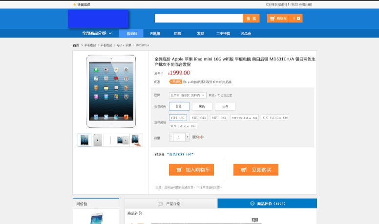
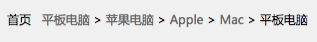
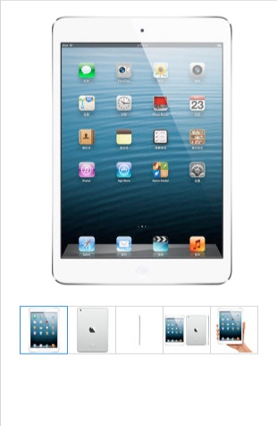
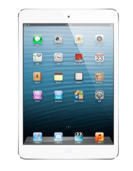
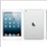
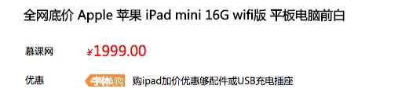
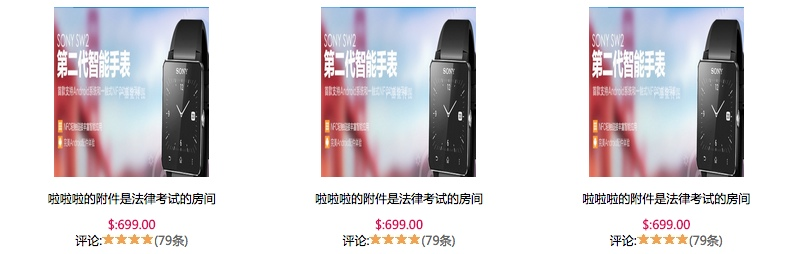
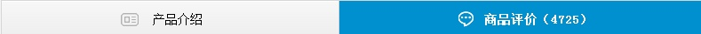
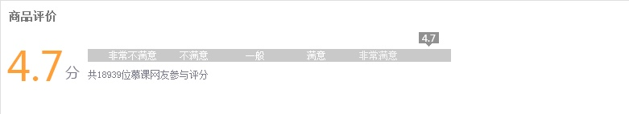
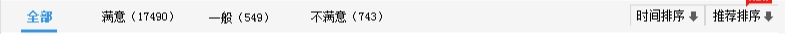

# EcommercialWeb
A Website Contains(component page and other special using skills) about Ecommercial

#整体说明

##首页


* 网址:index.html
* 说明文档:index.md

##产品选择页


* 产品选择页:productselect.html
* 说明文档:Ecomicial_productdetail.md

##产品类别页


* 产品类别页:productCategory.html
* 说明文档:productCategory.md

##产品筛选页


* 产品筛选页productFilterProduct.html
* 说明文档:productfilter.md

#组件化
###首页搜索组合框


####HTML
```
    <div class="logoBar">
	    <div class="comWidth">
	        <div class="logo fl">
	            <a href="#"></a>
	        </div>
	        <div class="search_box fl">
	            <input type="text" class="search_text fl">
	            <input type="button" value="搜索" class="search_btn fl">
	        </div>
	        <div class="shopCar fr">
	            <span class="shopTest">购物车</span>
	            <span class="shopNum">0</span>
	        </div>
	    </div>
	</div>
```
主要包含三块内容:

* logoBar用来指定宽度和北京
* logo这是左边的logo,search_box这是中间的搜索框
* shopCar这是右边的加入购物车按钮

######logo
里面包含一个图片,用于指定顶部的padding定位
######search_box
search_box用于指定宽度,高度以及padding-top,left的丁文
search_text用于接收输入文字,用于控制文字居中输入可以使用padding
search_btn右边的搜索按钮,这里通过
######shopCar
shopCar来绘制外边框
通过span来承载图片和文字
图片的定位通过backgroud left(10px) center,文字的定位通过text-incident和padding

####CSS
```
/*logoBar*/
.logoBar{  height: 85px;  background-color: #1B79D7;  }
/*logo logo*/
.logoBar .logo{  background: url("")  ; padding-left: 41px;  padding-top: 13px;  }
/*logo search_box*/
.search_box{width: 450px;  padding-top:23px;  padding-left: 50px;}
.search_box .search_text{  width: 360px;height: 35px; padding:0 5px;  }
.search_box .search_btn{ width: 70px;height:35px;font-size:14px;font-family: "Microsoft YaHei","微软雅黑";  background-color: #FFC800;color: white;  }
/*logo shop_car*/
.shopCar{  width: 145px; height: 35px; background-color: #FFC800;  margin-right: 59px;  margin-top: 23px;  font-size: 14px;font-family: "Microsoft YaHei", "微软雅黑";color: white;  }
.shopCar .shopTest{  width:87px;line-height: 35px;height: 100%;  background: url("../image/cart.jpg") 10px center no-repeat;  text-indent: 40px;  border-right: #E27A00 1px solid;  }
.shopCar .shopNum{  width: 26px;  text-align: right;  line-height: 35px;  border-left: #FF9C01 solid 1px;  padding-right: 30px;  background: url("../image/cartdown2.jpg") 33px center no-repeat;  }
```

####设计要点
* 需要分成三块,每块位置的对齐可以通过div的padding-top设置为统一高度就可以了.
* 其中带图标的按钮的设计,主要是通过外部的div绘制背景颜色和指定长宽,通过里面的span元素装进文字和图片,其中图片的定位通过backgroud,文字的定位通过text-incident,那么对于span来说一定是height:100%来撑开div

###水平列表


####HTML
```
    <div class="navBox">
        <div class="comWidth">
            <div class="shopClass fl">
                <h3>全部商品分类<i></i></h3>
            </div>
            <ul class="nav fl">
                <li><a href="#" CLASS="active">衣服撒</a></li>
                <li><a href="#">鞋子啦啦</a></li>
                <li><a href="#">包包</a></li>
                <li><a href="#">配饰啦啦</a></li>
                <li><a href="#">家居</a></li>
                <li><a href="#">男友啦啦</a></li>
            </ul>
        </div>
    </div>
```
主要包含三块内容:

* navBox用来指定宽度和北京
* shopClass承载左边的h3
* nav右边的列表组合列表

####CSS
```
/**navBox*/
.navBox{  height: 35px;  background-color: #1369C0; color: #FFF;  }
/**navBox shopClass*/
.navBox .shopClass{  height:17px; width:190px;position:relative;  }
.navBox .shopClass h3{  line-height:35px;  text-align: center;  }
.navBox .shopClass i{  background:url("") 11px center no-repeat;  margin-right: 10px;  width: 11px;  display: inline-block; overflow: hidden;  }
/**navBox nav*/
.navBox .nav{  font-family: "Microsoft YaHei", "微软雅黑";line-height: 35px;  }
.navBox .nav li{  float:left;  }
.navBox .nav a{  height: 35px;  display: inline-block;  padding: 0 35px; color: white;  }
.navBox .nav .active{  background-color: #4593FD;  }
```

####设计要点
* navBox这里指定了宽度和高度还有背景颜色
* shopClass这里是左边的文字
* nav这里面li用来指定浮动方向,a用来承载方块以及宽高,文字
* active这里单独拿出来作为激活状态的设置,变色

###垂直列表


####HTML
```
    <div class="shopClass_show">
	    <dl class="shopClass_item">
	        <dt><a href="#" class="b">手机</a><a href="#" class="b">数码</a><a href="#" class="b">合约机</a></dt>
	        <dd><a href="#">荣耀手机</a><a href="#">单反</a><a href="#">智能设备</a></dd>
	    </dl>
	    <dl class="shopClass_item">
	        <dt><a href="#" class="b">手机</a><a href="#" class="b">数码</a><a href="#" class="b">合约机</a></dt>
	        <dd><a href="#">荣耀手机</a><a href="#">单反</a><a href="#">智能设备</a></dd>
	    </dl>
	</div>
```

主要包含三块内容:

* shopClass_show用来指定宽度和北京
* shopClass_item这事每一个重复项
* 这里的重复想列表采用了dl dt dt的布局方式
* bshopCar这是右边的加入购物车按钮 

####CSS
```
/**shopClass_show*/
.shopClass_show{  font-size: 14px; font-family: "Microsoft YaHei", "微软雅黑";  background-color: #4593FD;  color:white;  position: absolute;  width:100%;  }
/**shopClass_show shopClass_item*/
.shopClass_show .shopClass_item{  text-align: left;  padding:10px 10px;  }
.shopClass_item{  border-bottom: #3487F2 solid 1px;  border-top: #5AA1FE solid 1px;  }
/**shopClass_show a dd*/
.shopClass_show .shopClass_item a{  display: inline-block;  margin:0 5px;  color:white;  }
.shopClass_item dd{  line-height: 28px;  font-size: 12px;  }
.shopClass_item .b{  font-size: 14px; font-weight: bold;  }
.shopClass_item .aLink{  widht:48px;height: 20px;  background: url('') left center no-repeat;display: inline-block; display: inline-block;  text-decoration: underline;  }
.shopClass_item .c{  font-size: 12px;  }
```

####设计要点
* shopClass_show定义了背景和大小
* shopClass_item 定义额重复元素的间距
* dd a等定义了每一个小的排列元素的大小


###关于相对定位和绝对定位


####HTML
```
    <div class="banner comWidth">
        <div class="banner_bar_big">
            <div class="img_box">
                <ul>
                    <li><a href="#"></a></li>
                    <li><a href="#"></a></li>
                </ul>
            </div>
            <div class="img_Num">
                <a href="#"></a>
                <a href="#"></a>
                <a href="#" class="active"></a>
            </div>
        </div>
    </div>
```
主要包含三块内容:

```
banner
	banner_bar_big  相对定位
		img_box	   绝对定位
		img_Num   绝对定位
```

* banner用来指定宽度和高度
* banner_bar_big这里用来存放图片
* img_Num这里存放下面的点击滚动的图标


####CSS
```
/**banner*/
.banner{  margin-bottom: 15px; height: 345px;  }
/**banner banner_bar_big*/
.banner_bar_big{  width:811px; height: 345px;  float: right; position:relative;overflow:hidden;  }
.banner_bar_big .img_box{  position: absolute;left: 0px;top:0px;  }
.banner_bar_big .img_box li{  float:right;  }
.banner_bar_big img{  width:811px; height: 345px; display: block;  }
/**banner banner_bar_samll*/
.banner_bar_samll{  width:188px; height: 396px;  float: right; position:relative;overflow:hidden;  }
.banner_bar_samll .img_box{  position: absolute;left: 0px;top:0px;  }
.banner_bar_samll .img_box li{  float:right;  }
.banner_bar_samll img{  width:188px; height: 396px; display: block;  }
/**banner img_Num*/
.img_Num{  position:absolute;bottom:20px;width:100%;text-align: center;  }
.img_Num a{  width:18px;height:5px;background: white; margin: 0px 3px; display: inline-block;  }
.img_Num .active{  background: #EC740D;  }
```
####设计要点
* banner的CSS定义了宽度和高度
* banner_bar_big用于有浮动存放图片,同时设置了**相对浮动**
* banner_bar_big banner_bar_samll用于定义不同大小的图片提供组件化的管理,可以以组件的形式设置轮播方式
* .banner_bar_samll .img_box**绝对布局**这样子可以使以背景来定位将图片和下面的轮播按钮贴上去
* .banner_bar_samll .img_Num**绝对布局**这样子可以使以背景来定位将图片和下面的轮播按钮贴上去
* banner_bar_big img设置图片的大小
* img_Num设置摆放位置居中，同时a设置内部的排列形式


###组合列表展示


####HTML
```
    <div class="rightArea">
        <div class="shopList_top clearfix">
            <div class="shop_item">
                <div class="shop_img">
                    <a></a>
                </div>
                <h3>HTC新渴望8系列</h3>
                <p>1899元</p>
            </div>
        </div>
        <div class="shopList_sm clearfix">
            <div class="shopItem_sm">
                <div class="shopItem_img">
                    <a></a>
                </div>
                <div class="shopItem_text">
                    <p>NFC技术一碰就对啦啦啦</p>
                    <h3>￥149</h3>
                </div>
            </div>
        </div>
	</div>
```
主要包含三块内容:
* 外面的有浮动的边框
* 两个列表分别对应大列表和小列表
* 每个列表都有相应的布局

```
rightArea
	shopList_top  大图列表外框
		shop_item	  大图listitem
			shop_img 图片
			h3  标题
			p    价格
	shopList_sm   小图列表外框
		shopItem_sm    小图listktem
			shopItem_img 图片
			p 介绍
			h3 价格
```

####CSS
```
/*shopList*/
.shopList{  height: 400px;  }
.shopList .leftArea{  width:190px;  }
.shopList .rightArea{  width:815px;  height: 392px;  margin-left:-20px;  border: 1px solid #999;  border-bottom: 3px solid #FF7021;  }
/*shopList shopList_top*/
.shopList .shopList_top .shop_item{  width:201px;  height: 279px;  border-right: 1px solid #999;  border-bottom: 1px solid #999;  text-align: center;  font-family: "Microsoft YaHei", "微软雅黑";  float: right;  }
.shopList .shopList_top .shop_item .shop_img {  text-align: center;  padding: 20px;  height:176px;  display: block;  }
.shopList .shopList_top .shop_item .shop_img img{  width: 129px;  height: 100%;  }
.shopList .shop_item h3{  font-size: 16px;    line-height: 24px;  }
.shopList .shop_item p{  font-size: 12px; color:#FF7300; line-height: 21px;  }
/*shopList shopItem_sm*/
.shopItem_sm{  width:201px;   border-right: 1px solid #999;height: 116px;  float: right;  }
.shopItem_sm .shopItem_img{  float: left;  width:80px;height: 90px; text-align: center;padding-top:14px;padding-left: 10px;  }
.shopItem_sm img{  width:80px;height: 90px;  }
.shopItem_sm .shopItem_text{  float: left;  padding-top: 28px;  width:105px;  text-align: center;  font-family: "Microsoft YaHei", "微软雅黑";  }
.shopItem_sm .shopItem_text p{  color:#FF7300;  font-size: 12px;  }
.shopItem_sm .shopItem_text h3{  line-height: 24px;  }
```

###导航条


####HTML
```
    <div class="user_position comWidth">
        首页
        <span>&nbsp;</span>
        <a href="#">平板电脑</a><span>&nbsp;&gt;</span>
        <a href="#">苹果电脑</a><span>&nbsp;&gt;</span>
        <a href="#">Apple</a><span>&nbsp;&gt;</span>
        <a href="#">Mac</a><span>&nbsp;&gt;</span>
        <em>平板电脑</em>
    </div>
```
####CSS
```
.user_position{height:42px;line-height: 42px;font-family: "Microsoft YaHei", "微软雅黑";font-size: 12px;}
.user_position em{font-style: normal;}
.user_position a:hover{text-decoration: underline}
```
####设计要点
* 通过设计行高来使导航的位置上下都有间隔
* 通过a,span标签来区分导航内容和导航间的特殊字符

###轮播图片

####HTML

```
	<div class="img_show">
	    <div class="big_img">
	        <a href="#"></a>
	    </div>
	    <ul class="sm_img clearfix">
	        <li><a href="#"></a></li>
	        <li><a href="#"></a></li>
	        <li><a href="#"></a></li>
	        <li><a href="#"></a></li>
	        <li><a href="#"></a></li>
	    </ul>
	</div>
```
####CSS

```
.img_show{width: 309px;}
.img_show .big_img{width:100%;height: 341px; text-align: center}
.img_show .sm_img{width:265px;margin:0 auto;}
.img_show .sm_img li{float: left;margin-left: -1px;}
.img_show .sm_img img{width:52px;height: 52px;border: 1px solid #CCC}
.img_show .sm_img .active{border: 1px solid #317EE7;position:relative;}
```

####设计要点
* 这个设计是外面一个大的div,里面包含两个小的div,分别用来包含上面的大图和下面的小图列表
* 上面大图的居中是通过外面包的div设置text-align:center来将里面的图片居中
* 下面的排列小图居中,因为里面的图片元素有五个,所以只能通过设置外面的ul设置它的宽度和最外层的父级div的margin:0px auto来设置居中
* 对于小图片的active的边框设计有两个技巧,一个是设置border:1px,同时margin-left:-px,来避免border的重叠出现由1px变成2px,还有就是最外层的div需要设置padding:1px来往右拉
* 设置active的时候有一个小技巧就是通过设置relative来使得新加的样式处于上层

###带图标

####HTML
```
<span class="hg">
	<i class="hg_icon">字体</i>购ipad加价优惠够配件或USB充电插座
</span>
```
####CSS
```
.hg{padding-top: 5px;display: inline-block;line-height: 16px;text-indent: 0px;}
.hg_icon{background: url("../image/huangou.jpg") left top no-repeat;width:52px;height: 18px;margin-right: 10px;
    display: inline-block;font-size: 12px;font-family: "Microsoft YaHei", "微软雅黑";font-style: normal;color: white;text-indent: 10px;
}
```
####设计要点
* 通过I图标设置背景图片,同时里面包含字体,这样一个带文本的图标就做出来
* 其中图标的大小和图片一致,同时字体的排列可以通过设置font的样式可以设置,同时设置indent可以调整字体的排列
* 确保i里面的有内容，才能保证两边的内容是一致对齐,同时span进行包裹

###组合标题

####HTML
```
	<div class="desc_content">
	    <h3 class="productdetail_title">全网底价 Apple 苹果 iPad mini 16G </h3>
	    <div class="dl clearfix">
	        <div class="dt">慕课网</div>
	        <div class="dd"><span class="desc_money"><em>￥</em>1999.00</span></div>
	    </div>
	    <div class="dl clearfix">
	        <div class="dt">优惠</div>
	        <div class="dd">
	            <span class="hg"><i class="hg_icon">字体</i>购ipad加价优惠够配</span>
	        </div>
	    </div>
	</div>
```
#### CSS
```
.desc_content{font-family: "Microsoft YaHei", "微软雅黑";  padding:10px;}
.desc_content h3 {line-height: 22px; font-size: 16px;font-weight: bold;padding:13px 25px;}
.desc_content .dl{text-indent:17px;margin: 10px;}
.desc_content .dt{float:left;width:75px;line-height: 25px;}
.desc_content .dd{float:left;line-height: 25px;}
.desc_content .desc_money{color: red; font-size: 18px;}
.desc_content em{font-size:12px;list-style: none}
.desc_content .hg{padding-top: 5px;display: inline-block;line-height: 16px;text-indent: 0px;}
.desc_content .hg_icon{background: url("../image/huangou.jpg") left top no-repeat;width:52px;height: 18px;margin-right: 10px;display: inline-block;font-size: 12px;font-family: "Microsoft YaHei", "微软雅黑";font-style: normal;color: white;text-indent: 10px;
}
```
####设计要点
* 总体布局是外面有一个大div进行嵌套
* 其中包含了一个h3是负责主标题
* 还有就是dl dt dd的内容用户负责下面两个不同的列


###带下拉内容的下拉框


####HTML
```
	<div class="select">
	    <span>海淀区五环内</span>
	    <span class="downloadcart"></span>
	    <ul class="show_select">
	        <li>啦啦啦</li>
	        <li>啦啦啦</li>
	        <li>啦啦啦</li>
	    </ul>
	</div>
```

####CSS
```
.select{
    float: left;
    border: 1px solid #999;
    height: 22px;
    line-height: 22px;
    background: #FFFFFF;
    padding-left:10px;
    padding-right:20px;
    position:relative;
}

.select .downloadcart{
    background: url('../image/cartdown.jpg') center center no-repeat;
    height:100%;
    width:20px;
    position:absolute; top:0;right:0;
}
.select .show_select{
    position:absolute; left:-1px; top:23px;
    width:100px;
    border: 1px solid #999;
    line-height: 22px;
    background: #FFFFFF;
    font-family: "Microsoft YaHei", "微软雅黑";
    display: none;
}
```

####设计要点
* 通过一个select来设定背景边框
* 里面包含两个span,其中一个span是存储文字,另外一个span是用来防止下拉箭头
* 垂直排列的就是下拉框的内容通过ul li来承载,这里使用display:none来隐藏了

###不带下拉内容的下拉框

####HTML
```
<dd class="screening_more">
        <ul>
            <li><a href="#">Samsung/三星</a></li>
        </ul>
</dd>
```
####CSS
```
.screening_more{
    border:#CCC solid 1px;height:23px;line-height: 23px;
    margin-top:4px;padding-right: 11px;padding-left: 11px;margin-right:10px;
    text-align: left;
    float:left;

}
.screening_more a{
    background: url('../image/cartdown.jpg') right center no-repeat;
    padding-right: 14px;
}
```
####设计要点
* 外面通过dd或者div绘制边框
* 里面则通过a标签放置图片和文字

###水平选择方块列表

####HTML
```
   <div class="desc_item desc_item_active">WIFI 16G PC</div>
   <div class="desc_item">WIFI 16G PC</div>
   <div class="desc_item">WIFI 16G PC</div>
```
####CSS
```
.desc_item{color:#666;padding:9px 10px;border:#CCC solid 1px;float: left;background-color: #FFF;margin-right: 10px;}
.desc_item_active{border:#317EE7 solid 1px;color:#333;}
.desc_item_sm{padding:1px 6px;}
```
####设计要点
* 通过desc_item设置padding能够支持文字无限扩大
* 通过desc_item设置边框,字体大小,浮动
* 通过单独设置active设置点击时候的效果
* 可以添加额外的desc_item_sm属性将上面的大面块变成小面块

###按钮数量输入框

####HTML
```
	<div class="desc_number clearfix">
        <div class="reduction">-</div>
        <div class="des_input">
            <input type="text" value="9">
        </div>
        <div class="plus">+</div>
    </div>
```

####CSS
```
..desc_number{border: #B2B2B2 solid 1px;height:32px;width:82px;text-indent:0px;}
.desc_number div{float: left;height: 100%;}
.reduction,.plus{width:15px;line-height: 32px;text-align: center;color:#333;}
.reduction{border-right: #CCC solid 1px;}
.plus{border-left: #CCC solid 1px;}
.des_input{width:42px;padding:0 4px;}
.des_input input{width:100%;height: 100%;line-height: 32px\9;text-align: center}
```
####设计要点
* 这里外面包一个大div用于设置边框,长宽
* 里面包含三个div分别是左中右,同时中间还包括了input
* 三个dive都进行左浮动,同时背景可以设置为三个图片,这里没有设置

###大图标的按钮

####HTML
```
	<div class="shop_buy">
        <div class="shopping_btn"></div>
        <span class="line"></span>
        <div class="buy_btn"></div>
    </div>
```

####CSS
```
.shop_buy{text-align: center;vertical-align: middle;}
.shopping_btn,.buy_btn{background: url("../image/addcart.jpg") left top no-repeat;display: inline-block;width:184px;height:48px;}
.shop_buy .line{width:1px;height:90px;margin:0px 40px;background-color: #CCC;display: inline-block;}
.shopping_btn,.buy_btn,.shop_buy .line{vertical-align: middle;}
```
####设计要点
* 中间采用一个span设置宽度为1px,高度为90
* 最重要的一点就是如何需要三个元素居中对齐则需要添加最后一个css将三个class设置为居中middle

###商品详情排列

水平排列 | 垂直排列
------------ | ------------- 
|  

####HTML
```
	<div class="item">
        <div class="img_item">
            <a href="#"></a>
        </div>
        <p>啦啦啦的附件是法律考试的房间</p>
        <p class="money">$:699.00</p>
        <p>评论:<span class="star"></span><span class="star"></span><span class="star"></span><span class="star"></span><a href="#">(79条)</a></p>
    </div>
```

####CSS
```
.item{width: 25%;text-align: left;font-family: "Microsoft YaHei", "微软雅黑";color: #000;float: left;}
.item .img_item{padding: 10px;text-align: center;}
.item .img_item img{height: 170px;width: 155px;}
.item .money {color:#D41052;font-weight: bold;padding-top:10px;}
.item span{ display: inline-block;}
.item .star{ width:13px;height: 12px; overflow: hidden; background: url('../image/star.jpg') left center no-repeat;}
```

```
.des_info .item{float: none;width: 100%;text-align: center}
.des_info .money{padding:0px;}
```

####设计要点
* 通过设定是否浮动来控制水平还是竖直排列,同时设定width:100%来设定排列的元素是一个还是多个


###水平条


####HTML
```
    <div class="des_infoContent">
        <ul class="des_tit">
            <li class="active"><span>产品介绍</span></li>
            <li><span>产品介绍</span></li>
        </ul>
    </div>
```
####CSS
```
.des_infoContent{border:#CCC solid 1px;background-color:#FFF;}
.des_tit{height:39px;border-bottom:#CCC solid 1px;background:url("../image/desc_title.jpg") left top repeat;}
.des_tit li{float:left;width:50%;font:14px/39px "宋体";text-align:center;border-left:solid 1px #ccc;margin-left:-1px;}
.des_tit .active{background-color:#0479CA;font-weight:bold;color:#FFF;position:relative;}
.des_tit span{padding-left:32px;display:inline-block;line-height:39px;}
```
####设计要点
* 整体的结构还是比较简单的title li
* des_tit对于title的背景通过设置找到垂直的图片然后repeat-x水平复制
* li的布局通过widht:50%;float:left进行水平裂开两列
* li的span内容包裹标题,通过padding-left:32px来放置小图标

###详细说明


####HTML
```
    <div class="info_text">
	    <div class="info_tit">
	        <h3>强烈推荐</h3><h4>货比三家 哈哈</h4>
	    </div>
	    <p>
	        QCon(全球软件开发者大会)是InfoQ主办的全球顶级技术盛会
	    </p>
	    <div class="hr_45"></div>
	</div>
```
####CSS
```
.info_text{padding:0 20px;}
.info_tit{height: 26px;border-bottom: #CCC solid 1px;font-family: "Microsoft YaHei", "微软雅黑";margin-bottom: 18px;}
.info_tit h3{float:left;font-size: 16px;color:#2357A5;border-bottom: #2357A5 solid 2px;height:26px;padding-right: 8px;margin-bottom: -1px;position: relative;}
.info_tit h4{font-size: 12px;line-height: 26px;padding-left: 4px;color: #656565;}
.info_text p{line-height: 22px;font-size: 14px;color: #656565;}
.center{display: block;margin:0 auto;}
```
####设计要点
* 通过h3,h4的浮动设置标题,设置底边的边框
* 通过外面包一个大div设置边框
* 哈哈,好简单都不想写了。。
* 后面如果想要加一个图片就直接a img好了

###商品评价


####HTML
```
	<div class="des_infoContent">
        <h3 class="shopDes_tit">商品评价</h3>
        <div class="score_box clearfix">
            <div class="score">
                <span>4.7</span><em>分</em>
            </div>
            <div class="score_speed">
                <ul class="score_speed_text">
                    <li class="speed01">不满意</li>
                    <li class="speed02">不满意</li>
                    <li class="speed03">不满意</li>
                    <li class="speed04">不满意</li>
                    <li class="speed05">不满意</li>
                </ul>
                <div class="score_num">
                    4.7<i></i>
                </div>
                <p class="clearfix">
                    共有多少人评价了这个东东,好不好，好不好,好不好
                </p>
            </div>
        </div>
    </div>
```

```
 des_infoContent
 	shopDes_it  上面的标题
 	score_box 下面的分数和右边的条形图
 		score 左边的4.7分
 		score_speed 右边的条形图
 			score_speed_text 文本
 			score_num 4.7分箭头
 			p 下面的描述内容
```

####CSS
```
.shopDes_tit{line-height: 38px;height: 38px;font-size: 14px;color: #656565;padding-left: 10px;}
.score_box{padding-left: 10px;}
.score{font-family: "Microsoft YaHei", "微软雅黑";float: left;}
.score em{font-size: 18px;color: #65657D;font-style: normal;}
.score span{font-size: 50px;color: #FF8F00;}
.score_speed{float: left;width:450px;height: 16px;background-color: #BDBDBD;color: #FFF;line-height: 16px;font-size: 12px;margin-top:12px;position:relative;}
.score_speed_text{height: 100%;overflow: hidden;}
.score_speed_text li{float: left;}
.score_speed_text .speed01{width:114px;text-indent: 26px;}
.score_speed_text .speed02{width:82px;}
.score_speed_text .speed03{width:76px;}
.score_speed_text .speed04{width:65px;}
.score_num{position:absolute;left:94%;top:-21px;text-align: center;width:25px;height:14px;background-color: #7F7F7F;}
.score_num i{border-width: 4px;border-style: solid dashed dashed dashed;width:0px;height: 0px;}
.score_speed p{color: #000000;padding-top: 15px;font-family: "Microsoft YaHei", "微软雅黑";text-indent: 3px;}
```
####设计要点
* 这里有一个设计巧妙的地方就是右上方的小图标
* 首先score_speed这个设置为相对定位
* score_num这个是图标的设置样式,会包含两个东西一个是上面的方块还有下面的箭头
* score_num采用相对定位设置于条形图上方position:absolute;left:94%;top:-21px
* 这里的speed01~04是可以用于确定文字的宽度和排列定位过程

###条形水平


####HTML
```
	<div class="review_tab clearfix">
        <ul class="review">
            <li><a href="#" class="active">全部</a></li>
            <li><a href="#">满意</a></li>
            <li><a href="#">一般</a></li>
            <li><a href="#">不满意</a></li>
        </ul>
        <div class="review_sort">
            <a href="#" class="review_time">时间排序</a>
            <a href="#" class="review_reco">推荐</a>
        </div>
    </div>
```

####CSS
```
.review_tab{height: 32px;background-color: #F2F2F2;}
.review{line-height: 32px;height: 100%;padding-left: 20px;float: left;}
.review li{float: left;height: 100%;margin-right: 40px;}
.review li a{display: inline-block;height: 30px;line-height: 30px;padding: 0 5px;}
.review .active{color: #317DE6;font-weight: bold;border-bottom: #317DE6 solid 2px;margin-bottom: -2px;position: relative;}
.review_sort{height: 20px;float: right;}
.review_sort a{display: inline-block;line-height: 20px;  height: 20px;border:solid 1px #CCC;float: right}
```
*嘿嘿不想写说明了,其实很简单的啊

###左侧导航

####HTML

```
	<div class="leftNav">
	    <h3 class="nav_title">手机 相机 数码</h3>
	    <div class="nav_cont">
	        <h3>手机通讯</h3>
	        <div class="navCont_list clearfix">
	            <ul>
	                <li><a href="#">全部手机</a></li>
	                <li><a href="#">全部手机</a></li>
	            </ul>
	        </div>
	    </div>
	</div>
```

* leftNav外部整体
* nav_title首标题
* nav_cont重复的内容项
* h3,navCont_list里面的重复排列项

####CSS

```
/*products leftNav*/
.products .leftNav{  background: #F3F3F3; border:#D7D7D7 1px solid;  }
/*leftNav nav_title*/
.leftNav .nav_title{  height: 34px; line-height: 34px; text-align: center; border-bottom: #D7D7D7 1px solid;  }
.leftNav h3{  text-align: left; line-height: 24px;  }
/*leftNav nav_cont*/
.nav_cont{  padding: 0 18px 2px;  margin-bottom: -2px;  }
.nav_cont .navCont_list{  line-height: 25px;  border-bottom: #D7D7D7 1px dotted;  }
.nav_cont .navCont_list li{  float: left; width: 50%; display: block; padding-left : 8px;  }
```

####设计要点
* leftNav用于确定边框左浮动
* nav_title设置居中,行高,h3用于承载字体
* nav_cont用于定位外部的重复列表布局
* navCont_list用于确定边框
* li用于垂直排列元素

###垂直商品列表


######标题:


####HTML
* 这里会包含两块内容:
* 上面的文字加下划线的标题
* 第二块就是图片列表的模块

上面的标题
```
       <div class="products_title">
		<h3>数码影像</h3>
	</div>
```

####CSS
```
.products_title{  height: 34px;  border-bottom: #CCCCCC 2px solid;  font-family: "Microsoft YaHei", "微软雅黑";font-size: 16px;  }
.products_title h3{  height: 34px; line-height: 34px;width:180px;  border-bottom: #096DBA 2px solid;text-indent: 9px;  }
```

####设计要点
* 其中下边框的设计是H3的颜色可以覆盖外面的products_title的边框颜色,这样就会有一条渐变的颜色,吊

######图片列表:


####HTML
* products_list
* item这个是可以重复的图片选项部分
* img_item money p

```
    <div class="products_list clearfix">
        <div class="item">
            <div class="img_item">
                <a href="#"></a>
            </div>
            <p>啦啦啦的附件是法律考试的房间</p>
            <p class="money">$:699.00</p>
            <p>评论:<span class="star"></span><span class="star"></span><span class="star"></span><span class="star"></span><a href="#">(79条)</a></p>
        </div> 
    </div>
```

####CSS
```
.products_list {  }
/*products_list item*/
.item{  width: 25%;  text-align: left;  font-family: "Microsoft YaHei", "微软雅黑";  color: #000;  float: left;  }
/*products_list img_item*/
.item .img_item{  padding: 10px;  text-align: center;  }
.item .img_item img{  height: 170px;width: 155px;  }
.item .money {  color:#D41052;font-weight: bold;padding-top:10px;  }
.item span{  display: inline-block;  }
.item .star{  width:13px;height: 12px; overflow: hidden; background: url('../image/star.jpg') left center no-repeat;  }
```
####设计要点
* item通过设置float:left,width:25%来指定四个排列在一起的布局
* img_item图片的居中设计通过指定边框,text-align:center
* img设置图片的大小
* 通过star的设置背景来绘制小星星,同时设置长宽以及元素span设置为内置排列来水平

###面板设计


####HTML
普通

```
    <div class="screening_box">
        <dl class="screening clearfix">
            <!--左边--->
            <dt>品牌</dt>
            <!--中间--->
            <dd class="limit"><a href="#" class="active">不限</a></dd>
            <dd class="screening_list">
                <ul>
                    <li><a href="#">Samsung/三星</a></li>
                    <li><a href="#">Samsung/三星</a></li>
                    <li><a href="#">Samsung/三星</a></li>
                    <li><a href="#">Samsung/三星</a></li>
                    <li><a href="#">Samsung/三星</a></li>
                </ul>
            </dd>
            <dd class="showmore">
                 <a>更多</a>
            </dd>
        </dl>
    </div>
```

带下拉实际上就是上面带下拉的重复

```
    <dl class="screening clearfix">
        <!--左边--->
        <dt>更多选项</dt>
        <dd class="screening_more">
            <ul>
                <li><a href="#">Samsung/三星</a></li>
            </ul>
        </dd>
        <dd class="screening_more">
            <ul>
                <li><a href="#">Samsung/三星</a></li>
            </ul>
        </dd>
    </dl>
```

自上而下这是一个重复的方式,自左而右的布局可以参考dl dt dd的方式

```
	screening_box 总体边框
		screening 一行面板边框
			dt     左边
			dd limit 中间
			dd screening_list 右边	
```

####CSS
```
.screening_box{  width:800px;  font-family: "Microsoft YaHei", "微软雅黑";  }
/*screening*/
.screening{  width:100%;  border-bottom: 1px solid #CCC;  padding-bottom: 10px;  margin-bottom: 2px;  }
/*screening dt*/
.screening dt{  float:left;  width:74px;  line-height: 32px;  text-align: right;  margin-right: 42px; color: #CCCCCC;}
/*screening limit*/
.screening .limit{  width:55px border:1px solid ;  line-height: 32px;  float:left;  margin-right: 20px;  }
.screening .active {  background-color: #1D7AD9;  line-height: 32px;  color:#FFF;  padding: 2px;  }
/*screening screening_list*/
.screening .screening_list{  width:526px;  line-height: 32px;  float:left;  margin-left: 10px;  }
.screening .screening_list li{  display: inline-block;  width:25%;  float:left;  }
.screening .screening_list li a{padding:2px;color: #1091DB;}
.screening_more{  border:#CCC solid 1px;height:23px;line-height: 23px;  margin-top:4px;padding-right: 11px;padding-left: 11px;margin-right:10px;  text-align: left;  float:left;  }
.screening_more a{background: url('../image/cartdown.jpg') right center no-repeat;  padding-right: 14px;  }
/*screening more*/
.screening .showmore{ float: right;width:86px; line-height: 32px;}
.screening .showmore a{background: url('../image/cartdown.jpg') right center no-repeat; padding-right: 14px;font-family: 宋体;font-size: 12px;}
```

###小图标的实现


####HTML
```
	<dd class="showmore">
        <a>更多</a>
    </dd>
```

####CSS
```
.screening .showmore{ float: right;width:86px; line-height: 32px;}
.screening .showmore a{background: url('../image/cartdown.jpg') right center no-repeat; padding-right: 14px;font-family: "Microsoft YaHei", "微软雅黑";font-size: 12px;}
```

这里的设计要点:

* 设置a标签的背景图片为向下的箭头
* 需要设置a标签的padding-left,因为图片会紧贴着文字,这样子可以为图片腾出空间

###按钮式小图标


####HTML
```
    <dd class="screening_more">
        <ul>
            <li><a href="#">Samsung/三星</a></li>
        </ul>
    </dd>
```
####CSS
```
.screening_more{  border:#CCC solid 1px;height:23px;line-height: 23px;  margin-top:4px;padding-right: 11px;padding-left: 11px;margin-right:10px;  text-align: left;  float:left;  }
.screening_more a{background: url('../image/cartdown.jpg') right center no-repeat;  padding-right: 14px;  }
```
这里的设计要点:

* 这里和上面不同的地方在于需要给screening_more设置边框

###评论导航


####HTML
```
    	<div class="review_list clearfix">
        <div class="review_userHead">
            <div class="review_user">
                
                <p>61...42</p>
                <p>金色会员</p>
            </div>
        </div>
        <div class="review_cont">
            <div class="review_t">
                <div class="starsBox">
                    <span class="star"></span><span class="star"></span><span class="star"></span><span class="star"></span><span class="star"></span>
                    <span class="stars_text">5分 满意</span>
                </div>
                <p>文字内容部分</p>
                <p><a href="#" class="ding">顶(0)</a><a href="#" class="cai">踩(0)</a></p>
            </div>
        </div>
    </div>
```
结构：

```
	review_list
		review_userHead  左边的头像
			review_user
				img
				p
				p
		review_cont        右边的聊天内容
			review_t
				starsBox
				p
```

####CSS
```
.review_list{padding-top:18px;}
.review_userHead{width:170px;float: left;}
.review_user{width:60px;text-align: center;margin-left: 40px;}
.review_user img{width:60px;height: 60px;display: block;}
.review_user p{line-height: 20px;}
.review_cont{float:left;display: block;width:500px;}
.review_t{line-height:24px;}
.review_cont p{line-height: 30px;}
.starsBox .star{margin-top:1px;}
.starsBox .star{  width:13px;height: 12px; overflow: hidden; background: url('../image/star.jpg') left center no-repeat;display: inline-block;}
.stars_text{font-weight: bold;padding-left: 10px;}
```

###评论导航


####HTML
```
	<div class="page">
        <a href="#">上一页</a>
        <a href="#">1</a><a href="#">2</a><a href="#">3</a><a href="#">4</a><a href="#">5</a><a href="#">6</a><a href="#">7</a>
        <a href="#">200</a>
        <a href="#">下一页</a>
        <span class="morePage">共200页, 到第</span>
        <input type="text" class="pageNum">页<input type="button" value="确认" class="page_btn">
    </div>
```

####CSS
```
.page{text-align: center;position:relative;z-index:2;}
.page a{height:24px;display: inline-block;line-height: 24px;border:#CCC solid 1px;padding:0 12px;margin: 0 2px;}
.page .hl{display:inline-block;padding:0 12px;margin:0px 2px;}
.morePage{padding-left: 14px;display:inline-block;height: 24px;line-height: 24px;}
.pageNum{width:29px;padding:0 3px;border:#ccc solid 1px;height: 24px;line-height: 24px\9;text-align: center;margin-left: 4px;}
.page_btn{width:44px;height:24px;line-height: 24px;background-color: #E8E8E8;border:#CCC solid 1px;}
.ye{padding:0 8px 0 6px;}
.page a,.page span,.page input{vertical-align: middle;position: relative}
```

