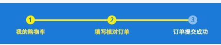
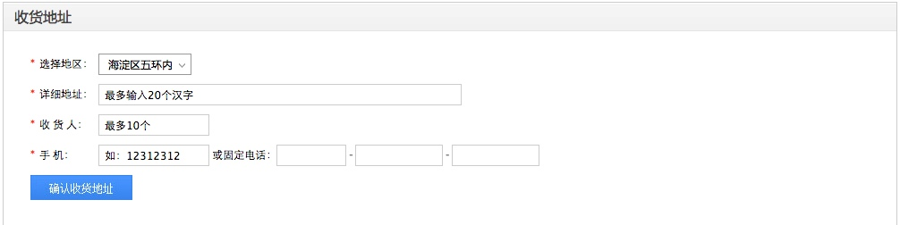

# 产品购物车页

产品购物车页的设计与开发过程详细介绍


## 设计模块


###左侧导航


####HTML
```
	<div class="stepBox fr">
	    <div class="step"></div>
	    <ul class="step_text">
	        <li class="s01 active">我的购物车</li>
	        <li class="s02 active">填写核对订单</li>
	        <li class="s03">订单提交成功</li>
	    </ul>
	</div>
```

####CSS

```
.stepBox{width:396px; padding-top:26px;}
.step{background:url(../image/step.jpg) left top no-repeat; height:19px;}
.step_text{color:#FFF; font-size:12px; line-height:30px;}
.step_text li{float:left;}
.s01,.s03{width:30%;}
.s02{width:40%; text-align:center;}
.s03{text-align:right;}
.step_text .active{color:#F3E402; font-weight:bold;}
```

####设计要点
* stepBox用于定位布局
* step 这是上面的图标图片
* step_text 这是下面的文字,其中有一个排列的规律就是30% 340% 30%的宽度设置


###面板输入详情内容


#####整体布局

```
shopping_item
	shopping_tit（标题）
	shopping_cont（输入内容）
		shopping_list （输入内容列表）
			li (每行输入内容)  =》例如选择地区 收货地址 收货人 手机
			li  span input span input 
			
```

####HTML
```
	<div class="shopping_item">
		<h3 class="shopping_tit">收货地址</h3>
		<div class="shopping_cont padding_shop">
			<ul class="shopping_list">
				<li><span class="shopping_list_text"><em>*</em>选择地区：</span>
					<div class="select">
						<h3>海淀区五环内</h3><span></span>
						<ul class="show_select">
							<li>上帝</li>
							<li>五道口</li>
							<li>上帝</li>
						</ul>
					</div>
				</li>
				<li><span class="shopping_list_text"><em>*</em>详细地址：</span><input type="text" value="最多输入20个汉字" class="input input_b"></li>
				<li><span class="shopping_list_text"><em>*</em>收 货 人：</span><input type="text" value="最多10个" class="input"></li>
				<li><span class="shopping_list_text"><em>*</em>手	机：</span><input type="text" value="如：12312312" class="input"><span class="cart_tel">&nbsp;或固定电话：</span><input type="text" class="input input_s"><span class="jian">-</span><input type="text" class="input input_s2"><span class="jian">-</span><input type="text" class="input input_s2"></li>
				<li><input type="button" class="affirm"></li>
			</ul>
		</div>
	</div>
```


####CSS
```
.shoppingCart{padding-top:10px;}
.shopping_item{border:#ccc solid 1px;}
.shopping_tit{height:31px; background:url(../image/shopping_bg.jpg) left top repeat-x;  color:#444444; font:16px/31px "Microsoft YaHei", "微软雅黑"; text-indent:12px; border-bottom:#E3E3E3 solid 1px;}
.padding_shop{padding:25px 30px;}
.shopping_list_text{float:left; width:76px; line-height:24px;}
.cart_tel,.input{vertical-align:middle;}
.cart_tel{display:inline-block; height:24px; line-height:24px;}
.shopping_list li{height:24px; margin-bottom:10px;}
.shopping_list_text em{color:#F30; font-style:normal; margin-right:5px;}
.input{height:22px; line-height:22px\9; border:#CCC solid 1px; padding:0 6px; width:110px;}
.input_b{width:392px;}
.input_s{width:64px;}
.input_s2{width:84px;}
.jian{padding:0 3px;}
.affirm{width:114px; height:28px;  background:url(../image/sh_btn.jpg) left top no-repeat;}
```

####设计要点
* shoppingCart设置Top间隔,shopping_item设置边框
* shopping_tit设置标题的背景(切图重复),文字样式,边框,以及段落
* shopping_cont设置输入内容的总体padding
* 输入内容部分通过 ul li进行循环,在每个li里面进行个性化定制,设置li行高,间距shopping_list li
* 其中左侧的文本可以采用通用格式shopping_list_text (<span>) 设置左浮动,行高,宽度
* 接下来右边的input,class=.input首先设置总体的Input样式 行高,边框,里面文字内嵌间距
* 然后设置宽度 input_b input_s input_s2	
* 最后按钮设置宽高,背景
* 最后一个多个选项输入直接的布局就是span input - span input -


