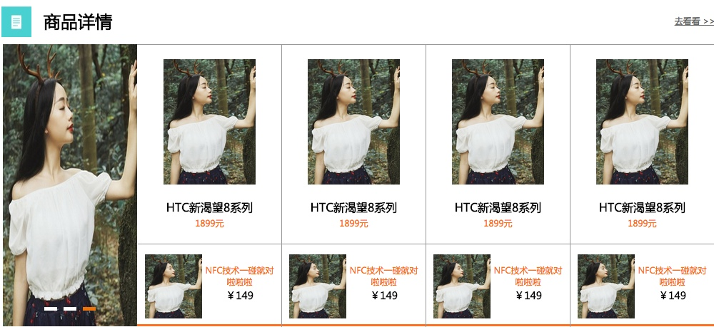
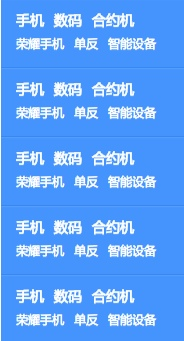
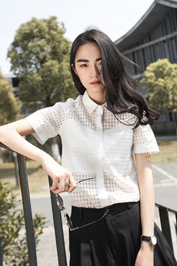

# 电商网站首页
电商网站首页的设计与开发过程详细介绍





## 设计模块
这个网页的整体设计布局来说,可以分成三块:

* Head模块:顶部的导航和搜索模块
* Middle模块:这个部分是商品的详细列表部分
* Down模块:建站的备案部分

## 布局
在开始教程之前需要赋予一些预设的全局CSS

```
body,ul,ol,li,p,h1,h2,h3,h4,h5,h6,form,fieldset,table,td,img,div,dl,dt,dd,input{
    margin: 0px;padding: 0px;
}
body{font-size: 12px;}
img{border:none;}
li{list-style: none}
input,select,textarea{outline: none;border:none;}
textarea{resize:none}
a{text-decoration:none;color:#656565}
/* 清除浮动*/
.clearfix:after{content:"";display: block;clear:both;}
.clearfix{zoom:1;}
/*公用*/
.fl{float:left;}
.fr{float: right;}
```
这里的CSS包含三种类型:一种是全局的标签样式,一种是清除浮动的,还有一种就是用于浮动定位的,包括左浮动和右浮动

###这里介绍网站的基本布局

```
div name = headerBar 
	div name = topBar
	div name = logoBar 
	div name = navBox(左边浮动框)
	div name = banner #浮动的banner滚动图
div name = shopList
	div name = leftArea(左边浮动框)
	div name = rightArea(右边浮动框)
```

## 组件

###首页搜索组合框


####HTML
```
    <div class="logoBar">
	    <div class="comWidth">
	        <div class="logo fl">
	            <a href="#"></a>
	        </div>
	        <div class="search_box fl">
	            <input type="text" class="search_text fl">
	            <input type="button" value="搜索" class="search_btn fl">
	        </div>
	        <div class="shopCar fr">
	            <span class="shopTest">购物车</span>
	            <span class="shopNum">0</span>
	        </div>
	    </div>
	</div>
```
主要包含三块内容:

* logoBar用来指定宽度和北京
* logo这是左边的logo,search_box这是中间的搜索框
* shopCar这是右边的加入购物车按钮

######logo
里面包含一个图片,用于指定顶部的padding定位
######search_box
search_box用于指定宽度,高度以及padding-top,left的丁文
search_text用于接收输入文字,用于控制文字居中输入可以使用padding
search_btn右边的搜索按钮,这里通过
######shopCar
shopCar来绘制外边框
通过span来承载图片和文字
图片的定位通过backgroud left(10px) center,文字的定位通过text-incident和padding

####CSS
```
/*logoBar*/
.logoBar{  height: 85px;  background-color: #1B79D7;  }
/*logo logo*/
.logoBar .logo{  background: url("")  ; padding-left: 41px;  padding-top: 13px;  }
/*logo search_box*/
.search_box{width: 450px;  padding-top:23px;  padding-left: 50px;}
.search_box .search_text{  width: 360px;height: 35px; padding:0 5px;  }
.search_box .search_btn{ width: 70px;height:35px;font-size:14px;font-family: "Microsoft YaHei","微软雅黑";  background-color: #FFC800;color: white;  }
/*logo shop_car*/
.shopCar{  width: 145px; height: 35px; background-color: #FFC800;  margin-right: 59px;  margin-top: 23px;  font-size: 14px;font-family: "Microsoft YaHei", "微软雅黑";color: white;  }
.shopCar .shopTest{  width:87px;line-height: 35px;height: 100%;  background: url("../image/cart.jpg") 10px center no-repeat;  text-indent: 40px;  border-right: #E27A00 1px solid;  }
.shopCar .shopNum{  width: 26px;  text-align: right;  line-height: 35px;  border-left: #FF9C01 solid 1px;  padding-right: 30px;  background: url("../image/cartdown2.jpg") 33px center no-repeat;  }
```

####设计要点
* 需要分成三块,每块位置的对齐可以通过div的padding-top设置为统一高度就可以了.
* 其中带图标的按钮的设计,主要是通过外部的div绘制背景颜色和指定长宽,通过里面的span元素装进文字和图片,其中图片的定位通过backgroud,文字的定位通过text-incident,那么对于span来说一定是height:100%来撑开div

###水平列表


####HTML
```
    <div class="navBox">
        <div class="comWidth">
            <div class="shopClass fl">
                <h3>全部商品分类<i></i></h3>
            </div>
            <ul class="nav fl">
                <li><a href="#" CLASS="active">衣服撒</a></li>
                <li><a href="#">鞋子啦啦</a></li>
                <li><a href="#">包包</a></li>
                <li><a href="#">配饰啦啦</a></li>
                <li><a href="#">家居</a></li>
                <li><a href="#">男友啦啦</a></li>
            </ul>
        </div>
    </div>
```
主要包含三块内容:

* navBox用来指定宽度和北京
* shopClass承载左边的h3
* nav右边的列表组合列表

####CSS
```
/**navBox*/
.navBox{  height: 35px;  background-color: #1369C0; color: #FFF;  }
/**navBox shopClass*/
.navBox .shopClass{  height:17px; width:190px;position:relative;  }
.navBox .shopClass h3{  line-height:35px;  text-align: center;  }
.navBox .shopClass i{  background:url("") 11px center no-repeat;  margin-right: 10px;  width: 11px;  display: inline-block; overflow: hidden;  }
/**navBox nav*/
.navBox .nav{  font-family: "Microsoft YaHei", "微软雅黑";line-height: 35px;  }
.navBox .nav li{  float:left;  }
.navBox .nav a{  height: 35px;  display: inline-block;  padding: 0 35px; color: white;  }
.navBox .nav .active{  background-color: #4593FD;  }
```

####设计要点
* navBox这里指定了宽度和高度还有背景颜色
* shopClass这里是左边的文字
* nav这里面li用来指定浮动方向,a用来承载方块以及宽高,文字
* active这里单独拿出来作为激活状态的设置,变色

###垂直列表



####HTML
```
    <div class="shopClass_show">
	    <dl class="shopClass_item">
	        <dt><a href="#" class="b">手机</a><a href="#" class="b">数码</a><a href="#" class="b">合约机</a></dt>
	        <dd><a href="#">荣耀手机</a><a href="#">单反</a><a href="#">智能设备</a></dd>
	    </dl>
	    <dl class="shopClass_item">
	        <dt><a href="#" class="b">手机</a><a href="#" class="b">数码</a><a href="#" class="b">合约机</a></dt>
	        <dd><a href="#">荣耀手机</a><a href="#">单反</a><a href="#">智能设备</a></dd>
	    </dl>
	</div>
```

主要包含三块内容:

* shopClass_show用来指定宽度和北京
* shopClass_item这事每一个重复项
* 这里的重复想列表采用了dl dt dt的布局方式
* bshopCar这是右边的加入购物车按钮 

####CSS
```
/**shopClass_show*/
.shopClass_show{  font-size: 14px; font-family: "Microsoft YaHei", "微软雅黑";  background-color: #4593FD;  color:white;  position: absolute;  width:100%;  }
/**shopClass_show shopClass_item*/
.shopClass_show .shopClass_item{  text-align: left;  padding:10px 10px;  }
.shopClass_item{  border-bottom: #3487F2 solid 1px;  border-top: #5AA1FE solid 1px;  }
/**shopClass_show a dd*/
.shopClass_show .shopClass_item a{  display: inline-block;  margin:0 5px;  color:white;  }
.shopClass_item dd{  line-height: 28px;  font-size: 12px;  }
.shopClass_item .b{  font-size: 14px; font-weight: bold;  }
.shopClass_item .aLink{  widht:48px;height: 20px;  background: url('') left center no-repeat;display: inline-block; display: inline-block;  text-decoration: underline;  }
.shopClass_item .c{  font-size: 12px;  }
```

####设计要点
* shopClass_show定义了背景和大小
* shopClass_item 定义额重复元素的间距
* dd a等定义了每一个小的排列元素的大小


###关于相对定位和绝对定位


####HTML
```
    <div class="banner comWidth">
        <div class="banner_bar_big">
            <div class="img_box">
                <ul>
                    <li><a href="#"></a></li>
                    <li><a href="#"></a></li>
                </ul>
            </div>
            <div class="img_Num">
                <a href="#"></a>
                <a href="#"></a>
                <a href="#" class="active"></a>
            </div>
        </div>
    </div>
```
主要包含三块内容:

```
banner
	banner_bar_big  相对定位
		img_box	   绝对定位
		img_Num   绝对定位
```

* banner用来指定宽度和高度
* banner_bar_big这里用来存放图片
* img_Num这里存放下面的点击滚动的图标


####CSS
```
/**banner*/
.banner{  margin-bottom: 15px; height: 345px;  }
/**banner banner_bar_big*/
.banner_bar_big{  width:811px; height: 345px;  float: right; position:relative;overflow:hidden;  }
.banner_bar_big .img_box{  position: absolute;left: 0px;top:0px;  }
.banner_bar_big .img_box li{  float:right;  }
.banner_bar_big img{  width:811px; height: 345px; display: block;  }
/**banner banner_bar_samll*/
.banner_bar_samll{  width:188px; height: 396px;  float: right; position:relative;overflow:hidden;  }
.banner_bar_samll .img_box{  position: absolute;left: 0px;top:0px;  }
.banner_bar_samll .img_box li{  float:right;  }
.banner_bar_samll img{  width:188px; height: 396px; display: block;  }
/**banner img_Num*/
.img_Num{  position:absolute;bottom:20px;width:100%;text-align: center;  }
.img_Num a{  width:18px;height:5px;background: white; margin: 0px 3px; display: inline-block;  }
.img_Num .active{  background: #EC740D;  }
```
####设计要点
* banner的CSS定义了宽度和高度
* banner_bar_big用于有浮动存放图片,同时设置了**相对浮动**
* banner_bar_big banner_bar_samll用于定义不同大小的图片提供组件化的管理,可以以组件的形式设置轮播方式
* .banner_bar_samll .img_box**绝对布局**这样子可以使以背景来定位将图片和下面的轮播按钮贴上去
* .banner_bar_samll .img_Num**绝对布局**这样子可以使以背景来定位将图片和下面的轮播按钮贴上去
* banner_bar_big img设置图片的大小
* img_Num设置摆放位置居中，同时a设置内部的排列形式


###组合列表展示


####HTML
```
    <div class="rightArea">
        <div class="shopList_top clearfix">
            <div class="shop_item">
                <div class="shop_img">
                    <a></a>
                </div>
                <h3>HTC新渴望8系列</h3>
                <p>1899元</p>
            </div>
        </div>
        <div class="shopList_sm clearfix">
            <div class="shopItem_sm">
                <div class="shopItem_img">
                    <a></a>
                </div>
                <div class="shopItem_text">
                    <p>NFC技术一碰就对啦啦啦</p>
                    <h3>￥149</h3>
                </div>
            </div>
        </div>
	</div>
```
主要包含三块内容:
* 外面的有浮动的边框
* 两个列表分别对应大列表和小列表
* 每个列表都有相应的布局

```
rightArea
	shopList_top  大图列表外框
		shop_item	  大图listitem
			shop_img 图片
			h3  标题
			p    价格
	shopList_sm   小图列表外框
		shopItem_sm    小图listktem
			shopItem_img 图片
			p 介绍
			h3 价格
```

####CSS
```
/*shopList*/
.shopList{  height: 400px;  }
.shopList .leftArea{  width:190px;  }
.shopList .rightArea{  width:815px;  height: 392px;  margin-left:-20px;  border: 1px solid #999;  border-bottom: 3px solid #FF7021;  }
/*shopList shopList_top*/
.shopList .shopList_top .shop_item{  width:201px;  height: 279px;  border-right: 1px solid #999;  border-bottom: 1px solid #999;  text-align: center;  font-family: "Microsoft YaHei", "微软雅黑";  float: right;  }
.shopList .shopList_top .shop_item .shop_img {  text-align: center;  padding: 20px;  height:176px;  display: block;  }
.shopList .shopList_top .shop_item .shop_img img{  width: 129px;  height: 100%;  }
.shopList .shop_item h3{  font-size: 16px;    line-height: 24px;  }
.shopList .shop_item p{  font-size: 12px; color:#FF7300; line-height: 21px;  }
/*shopList shopItem_sm*/
.shopItem_sm{  width:201px;   border-right: 1px solid #999;height: 116px;  float: right;  }
.shopItem_sm .shopItem_img{  float: left;  width:80px;height: 90px; text-align: center;padding-top:14px;padding-left: 10px;  }
.shopItem_sm img{  width:80px;height: 90px;  }
.shopItem_sm .shopItem_text{  float: left;  padding-top: 28px;  width:105px;  text-align: center;  font-family: "Microsoft YaHei", "微软雅黑";  }
.shopItem_sm .shopItem_text p{  color:#FF7300;  font-size: 12px;  }
.shopItem_sm .shopItem_text h3{  line-height: 24px;  }
```


