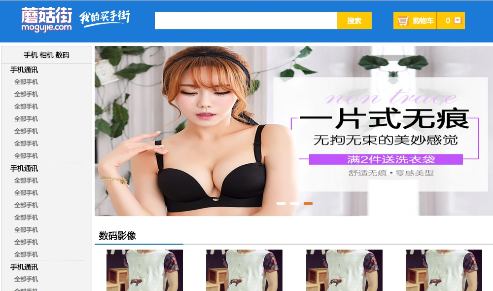
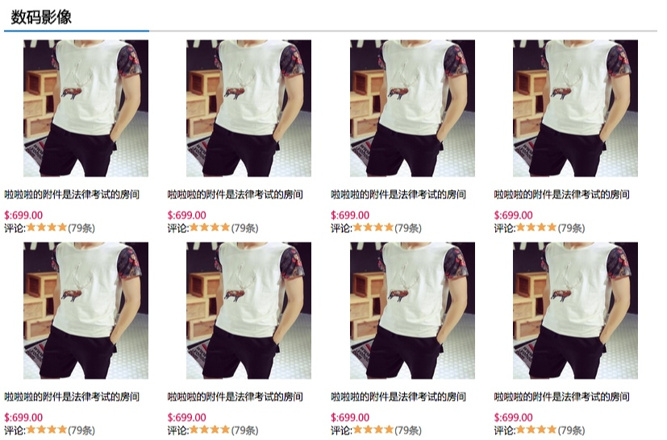
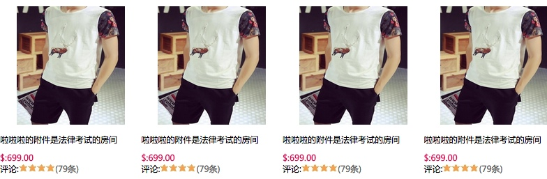

# 产品分类页

产品分类页的设计与开发过程详细介绍




## 设计模块
这个网页的整体设计布局来说,可以分成三块:

* Head模块:顶部的导航和搜索模块这是直接拿来复用的
* Left模块:左边浮动部分,用于承载列表
* Right模块:右边浮动部分,用于承载图片和商品列表

```
div headerBar
div products
	div leftArea leftNav
	div rightArea
		div banner
		div products_title
		div products_list
```

###左侧导航

####HTML

```
	<div class="leftNav">
	    <h3 class="nav_title">手机 相机 数码</h3>
	    <div class="nav_cont">
	        <h3>手机通讯</h3>
	        <div class="navCont_list clearfix">
	            <ul>
	                <li><a href="#">全部手机</a></li>
	                <li><a href="#">全部手机</a></li>
	            </ul>
	        </div>
	    </div>
	</div>
```

* leftNav外部整体
* nav_title首标题
* nav_cont重复的内容项
* h3,navCont_list里面的重复排列项

####CSS

```
/*products leftNav*/
.products .leftNav{  background: #F3F3F3; border:#D7D7D7 1px solid;  }
/*leftNav nav_title*/
.leftNav .nav_title{  height: 34px; line-height: 34px; text-align: center; border-bottom: #D7D7D7 1px solid;  }
.leftNav h3{  text-align: left; line-height: 24px;  }
/*leftNav nav_cont*/
.nav_cont{  padding: 0 18px 2px;  margin-bottom: -2px;  }
.nav_cont .navCont_list{  line-height: 25px;  border-bottom: #D7D7D7 1px dotted;  }
.nav_cont .navCont_list li{  float: left; width: 50%; display: block; padding-left : 8px;  }
```

####设计要点
* leftNav用于确定边框左浮动
* nav_title设置居中,行高,h3用于承载字体
* nav_cont用于定位外部的重复列表布局
* navCont_list用于确定边框
* li用于垂直排列元素

###垂直商品列表



######标题:


####HTML
* 这里会包含两块内容:
* 上面的文字加下划线的标题
* 第二块就是图片列表的模块

上面的标题
```
       <div class="products_title">
		<h3>数码影像</h3>
	</div>
```

####CSS
```
.products_title{  height: 34px;  border-bottom: #CCCCCC 2px solid;  font-family: "Microsoft YaHei", "微软雅黑";font-size: 16px;  }
.products_title h3{  height: 34px; line-height: 34px;width:180px;  border-bottom: #096DBA 2px solid;text-indent: 9px;  }
```

####设计要点
* 其中下边框的设计是H3的颜色可以覆盖外面的products_title的边框颜色,这样就会有一条渐变的颜色,吊

######图片列表:


####HTML
* products_list
* item这个是可以重复的图片选项部分
* img_item money p

```
    <div class="products_list clearfix">
        <div class="item">
            <div class="img_item">
                <a href="#"></a>
            </div>
            <p>啦啦啦的附件是法律考试的房间</p>
            <p class="money">$:699.00</p>
            <p>评论:<span class="star"></span><span class="star"></span><span class="star"></span><span class="star"></span><a href="#">(79条)</a></p>
        </div> 
    </div>
```

####CSS
```
.products_list {  }
/*products_list item*/
.item{  width: 25%;  text-align: left;  font-family: "Microsoft YaHei", "微软雅黑";  color: #000;  float: left;  }
/*products_list img_item*/
.item .img_item{  padding: 10px;  text-align: center;  }
.item .img_item img{  height: 170px;width: 155px;  }
.item .money {  color:#D41052;font-weight: bold;padding-top:10px;  }
.item span{  display: inline-block;  }
.item .star{  width:13px;height: 12px; overflow: hidden; background: url('../image/star.jpg') left center no-repeat;  }
```
####设计要点
* item通过设置float:left,width:25%来指定四个排列在一起的布局
* img_item图片的居中设计通过指定边框,text-align:center
* img设置图片的大小
* 通过star的设置背景来绘制小星星,同时设置长宽以及元素span设置为内置排列来水平


