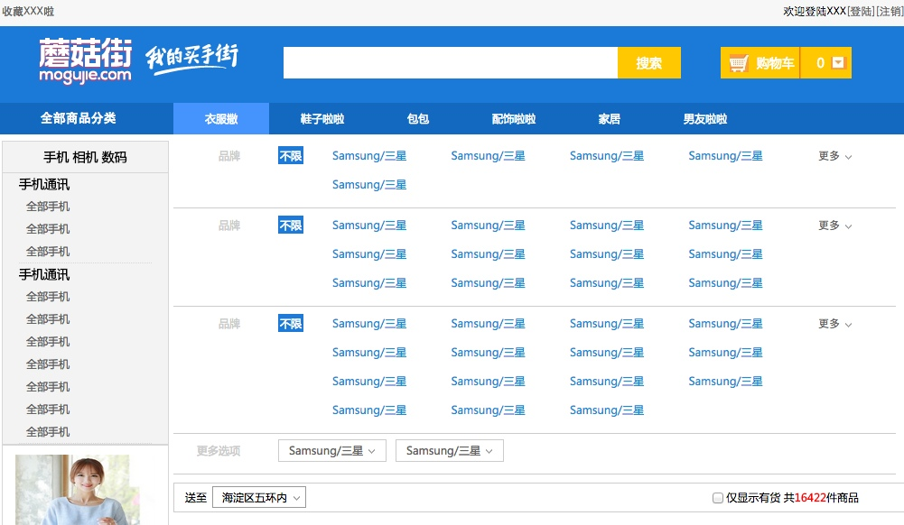
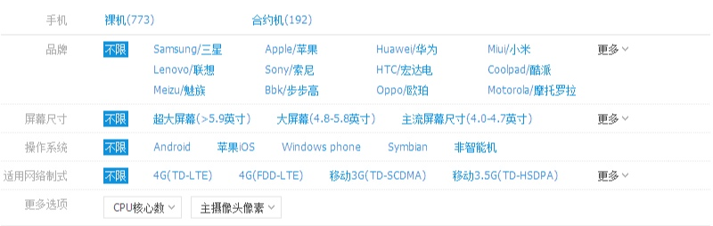
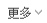

# 电商网站产品筛选页
电商网站产品筛选页设计与开发过程详细介绍



## 设计模块
这个网页的整体设计布局来说,可以分成两块:

* 一块是右边的选择点击筛选面板
* 一块就是下面的商品详情布局界面

###这里介绍网站的基本布局

```
div name = leftArea 
	div name = leftNav  上面的分类列表
	div name = leftlist    图片详细列表 
div name = rightArea
	div name = screening_box 筛选面板
	div name = products_title  商品详情列表
```

## 布局组件

###面板设计


####HTML
普通

```
    <div class="screening_box">
        <dl class="screening clearfix">
            <!--左边--->
            <dt>品牌</dt>
            <!--中间--->
            <dd class="limit"><a href="#" class="active">不限</a></dd>
            <dd class="screening_list">
                <ul>
                    <li><a href="#">Samsung/三星</a></li>
                    <li><a href="#">Samsung/三星</a></li>
                    <li><a href="#">Samsung/三星</a></li>
                    <li><a href="#">Samsung/三星</a></li>
                    <li><a href="#">Samsung/三星</a></li>
                </ul>
            </dd>
            <dd class="showmore">
                 <a>更多</a>
            </dd>
        </dl>
    </div>
```

带下拉实际上就是上面带下拉的重复

```
    <dl class="screening clearfix">
        <!--左边--->
        <dt>更多选项</dt>
        <dd class="screening_more">
            <ul>
                <li><a href="#">Samsung/三星</a></li>
            </ul>
        </dd>
        <dd class="screening_more">
            <ul>
                <li><a href="#">Samsung/三星</a></li>
            </ul>
        </dd>
    </dl>
```

自上而下这是一个重复的方式,自左而右的布局可以参考dl dt dd的方式

```
	screening_box 总体边框
		screening 一行面板边框
			dt     左边
			dd limit 中间
			dd screening_list 右边	
```

####CSS
```
.screening_box{  width:800px;  font-family: "Microsoft YaHei", "微软雅黑";  }
/*screening*/
.screening{  width:100%;  border-bottom: 1px solid #CCC;  padding-bottom: 10px;  margin-bottom: 2px;  }
/*screening dt*/
.screening dt{  float:left;  width:74px;  line-height: 32px;  text-align: right;  margin-right: 42px; color: #CCCCCC;}
/*screening limit*/
.screening .limit{  width:55px border:1px solid ;  line-height: 32px;  float:left;  margin-right: 20px;  }
.screening .active {  background-color: #1D7AD9;  line-height: 32px;  color:#FFF;  padding: 2px;  }
/*screening screening_list*/
.screening .screening_list{  width:526px;  line-height: 32px;  float:left;  margin-left: 10px;  }
.screening .screening_list li{  display: inline-block;  width:25%;  float:left;  }
.screening .screening_list li a{padding:2px;color: #1091DB;}
.screening_more{  border:#CCC solid 1px;height:23px;line-height: 23px;  margin-top:4px;padding-right: 11px;padding-left: 11px;margin-right:10px;  text-align: left;  float:left;  }
.screening_more a{background: url('../image/cartdown.jpg') right center no-repeat;  padding-right: 14px;  }
/*screening more*/
.screening .showmore{ float: right;width:86px; line-height: 32px;}
.screening .showmore a{background: url('../image/cartdown.jpg') right center no-repeat; padding-right: 14px;font-family: 宋体;font-size: 12px;}
```

###小图标的实现



####HTML
```
	<dd class="showmore">
        <a>更多</a>
    </dd>
```

####CSS
```
.screening .showmore{ float: right;width:86px; line-height: 32px;}
.screening .showmore a{background: url('../image/cartdown.jpg') right center no-repeat; padding-right: 14px;font-family: "Microsoft YaHei", "微软雅黑";font-size: 12px;}
```

这里的设计要点:

* 设置a标签的背景图片为向下的箭头
* 需要设置a标签的padding-left,因为图片会紧贴着文字,这样子可以为图片腾出空间

###按钮式小图标


####HTML
```
    <dd class="screening_more">
        <ul>
            <li><a href="#">Samsung/三星</a></li>
        </ul>
    </dd>
```
####CSS
```
.screening_more{  border:#CCC solid 1px;height:23px;line-height: 23px;  margin-top:4px;padding-right: 11px;padding-left: 11px;margin-right:10px;  text-align: left;  float:left;  }
.screening_more a{background: url('../image/cartdown.jpg') right center no-repeat;  padding-right: 14px;  }
```
这里的设计要点:

* 这里和上面不同的地方在于需要给screening_more设置边框

###评论导航


####HTML
```
    	<div class="review_list clearfix">
        <div class="review_userHead">
            <div class="review_user">
                
                <p>61...42</p>
                <p>金色会员</p>
            </div>
        </div>
        <div class="review_cont">
            <div class="review_t">
                <div class="starsBox">
                    <span class="star"></span><span class="star"></span><span class="star"></span><span class="star"></span><span class="star"></span>
                    <span class="stars_text">5分 满意</span>
                </div>
                <p>文字内容部分</p>
                <p><a href="#" class="ding">顶(0)</a><a href="#" class="cai">踩(0)</a></p>
            </div>
        </div>
    </div>
```
结构：

```
	review_list
		review_userHead  左边的头像
			review_user
				img
				p
				p
		review_cont        右边的聊天内容
			review_t
				starsBox
				p
```

####CSS
```
.review_list{padding-top:18px;}
.review_userHead{width:170px;float: left;}
.review_user{width:60px;text-align: center;margin-left: 40px;}
.review_user img{width:60px;height: 60px;display: block;}
.review_user p{line-height: 20px;}
.review_cont{float:left;display: block;width:500px;}
.review_t{line-height:24px;}
.review_cont p{line-height: 30px;}
.starsBox .star{margin-top:1px;}
.starsBox .star{  width:13px;height: 12px; overflow: hidden; background: url('../image/star.jpg') left center no-repeat;display: inline-block;}
.stars_text{font-weight: bold;padding-left: 10px;}
```


